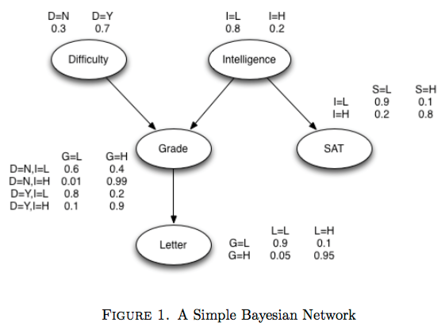

##Problem Set #1

What is 
<math><mi>P</mi>
<mfenced><mrow>
<mi>X</mi>
<mo>=</mo>
<mi>bus</mi>
</mrow></mfenced>
</math>?

The prior probability is 
<math> 
<mfrac>
<mi>1</mi><mi>3</mi>
</mfrac>
</math>, since she takes the bus 10 days out of the month. 

The evidence is that she arrived on time. The probability of this happening when she takes the bus is <math> 
<mfrac>
<mi>1</mi><mi>2</mi>
</mfrac>
</math>.

The probability that she took the bus given she arrived on time is:

$$ P(X=bus \mid ontime) = \frac{P(evidence \mid X=bus) \,P(X=bus)}{P(evidence \mid X=bus) \, P(X=bus) + P(evidence \mid X \neq bus) \, P(X \neq bus)} $$
  
$$ P(X=bus \mid ontime) = \frac{(\frac{1}{2}) \,(\frac{1}{3})}{(\frac{1}{3}) \, (\frac{1}{2}) + (\frac{9}{10}) \, (\frac{2}{3})} $$

$$ P(X=bus \mid ontime) = \frac{(\frac{1}{6})}{(\frac{5}{30}) + (\frac{18}{30})} $$

$$ P(X=bus \mid ontime) = \frac{(\frac{1}{6})}{(\frac{23}{30})} $$

$$ P(X=bus \mid ontime) = (\frac{1}{6}) \times (\frac{30}{23}) $$

$$ P(X=bus \mid ontime) = \frac{15}{69} $$

$$ P(X=bus \mid ontime) \approx 0.217 $$

Does this result check out using "Bayesian intuition"? It is somewhat unlikely that my colleague takes the bus (p ~ 0.33). When she does take the bus, it is even probability that she'll be late or on time (p = 0.5). So, if she does get to work on time, that evidence doesn't push me to think that she took the bus... since the train gets her here on time with p = 0.9, if anything I'd guess she took the train. Therefore, probability slightly less than the prior of <math> 
<mfrac>
<mi>1</mi><mi>3</mi>
</mfrac>
</math> , which <math> 
<mfrac>
<mi>15</mi><mi>69</mi>
</mfrac>
</math> is, makes intuitive sense. 


##Problem Set #2
Use the rGrain package to develop a Bayesian Network that describes the relationship between course difficulty, SAT scores, intelligence, and letters of recommendation. 

 

```{r, message=FALSE}
require(gRain)

LH <- c("low", "high")
YN <- c("no", "yes")

difficulty <- cptable(~difficulty, values=c(0.3, 0.7), levels=YN)
intelligence <- cptable(~intelligence, values=c(0.8,0.2), levels=LH)
SAT.Int <- cptable(~SAT|intelligence, values=c(0.9, 0.1, 0.2, 0.8), levels=LH)
LetRec.Grade <-cptable(~letter|grade, values=c(0.9, 0.1, 0.05, 0.95), levels=LH)
grade <- cptable(~grade|difficulty:intelligence, values=c(0.6, 0.4, 0.01, 0.99, 0.8, 0.2, 0.1, 0.9), levels=LH)

plist <- compileCPT(list(difficulty, intelligence, SAT.Int, LetRec.Grade, grade ))

net1 <- grain(plist)

(difficulty.initial <- querygrain(net1, nodes="difficulty"))
```

What happens to the probability of Difficulty of Course when you present the evidence that the received recommendation letter was good?
```{r}

letter.good <- setEvidence(net1, evidence=list(letter="high"))

(difficulty.letter <- querygrain(letter.good, nodes="difficulty"))
```

What happens to the probability of Difficulty of Course when you present the evidence that the received recommendation letter and SAT scores were both good?
```{r}
SAT.letter.good <- setEvidence(net1, evidence=list(letter="high", SAT="high"))

(difficulty.letter <- querygrain(SAT.letter.good, nodes="difficulty"))
```
